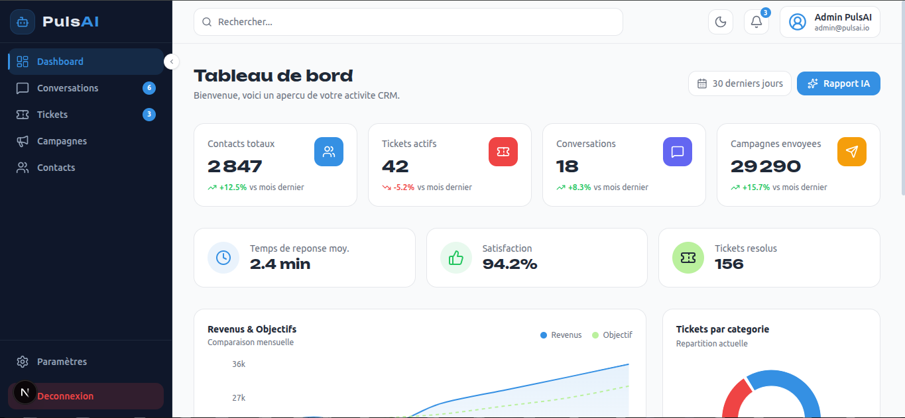
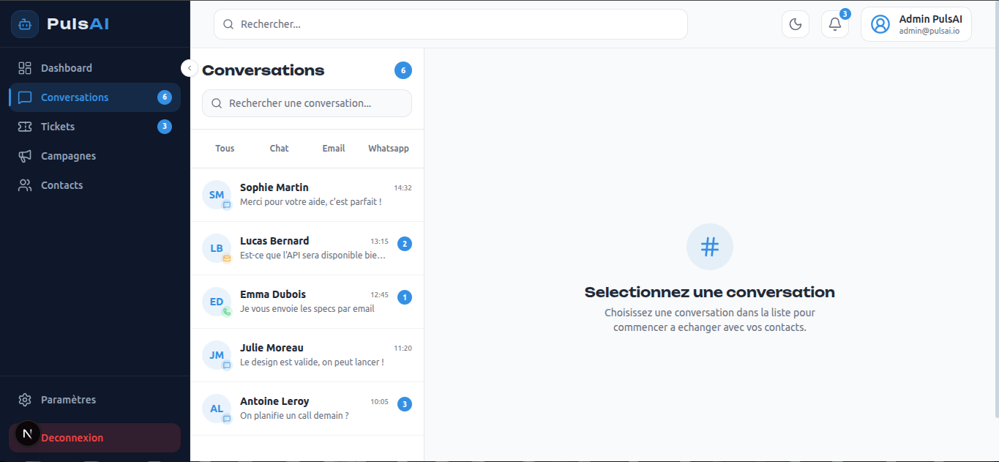
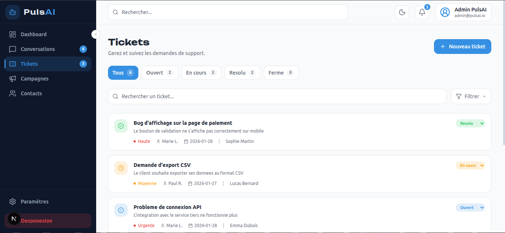
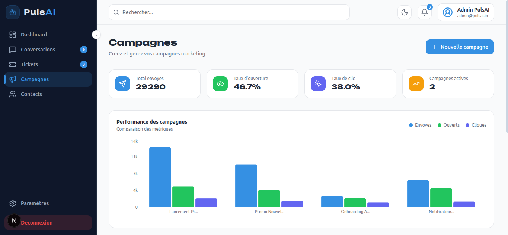
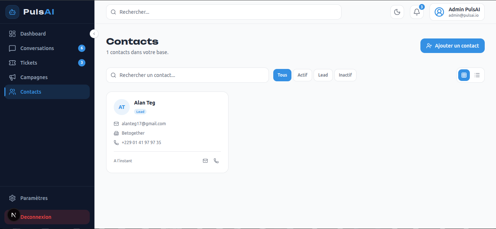
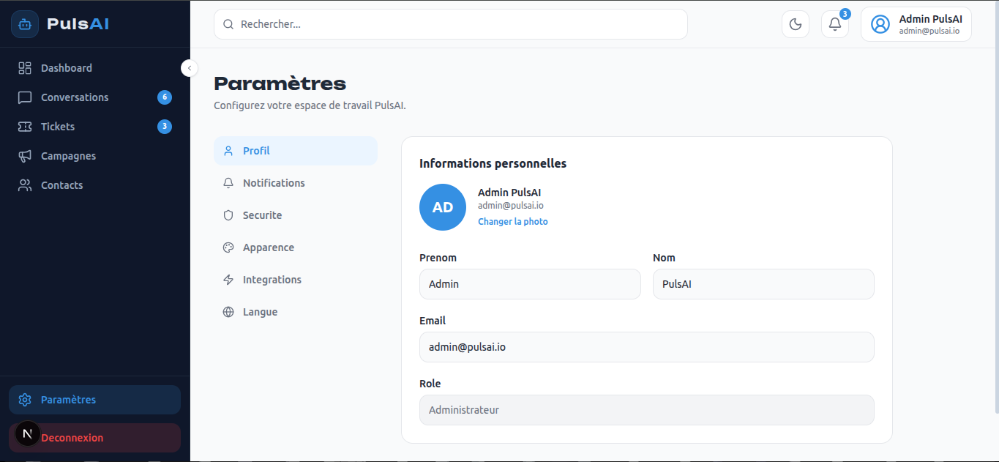

# PulsAI CRM Dashboard

## Description du projet
PulsAI est une interface CRM moderne construite avec Next.js.  
Le projet propose un dashboard unifié pour gérer les conversations, tickets, campagnes marketing, contacts et paramètres, avec une UI animée et responsive.

## Stack technique utilisée
- Framework: `Next.js` (App Router)
- UI: `React`
- Styling: `TailwindCSS`
- Icônes: `Lucide React`
- Animations: `Framer Motion`
- Graphiques: `Recharts`
- Gestion du thème: `next-themes`

## Instructions d'installation
1. Installer les dépendances:
```bash
npm install
```

2. Lancer le serveur de développement:
```bash
npm run dev
```

3. Ouvrir l'application:
`http://localhost:3000`

## Captures d'écran des principales pages
Ajoute les images dans `docs/screenshots/` avec les noms ci-dessous.

### Dashboard


### Conversations


### Tickets


### Campagnes


### Contacts


### Paramètres


## Liste des pages implémentées
- `/` : Dashboard
- `/conversations` : Gestion des conversations
- `/tickets` : Gestion des tickets
- `/campaigns` : Gestion des campagnes marketing
- `/contacts` : Gestion des contacts
- `/settings` : Paramètres de l'application
